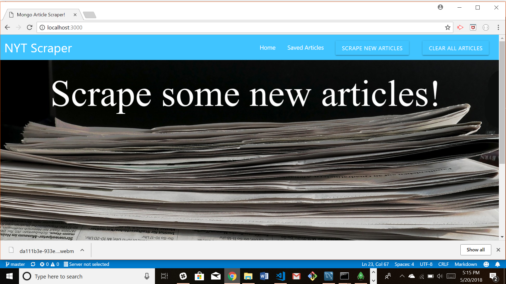
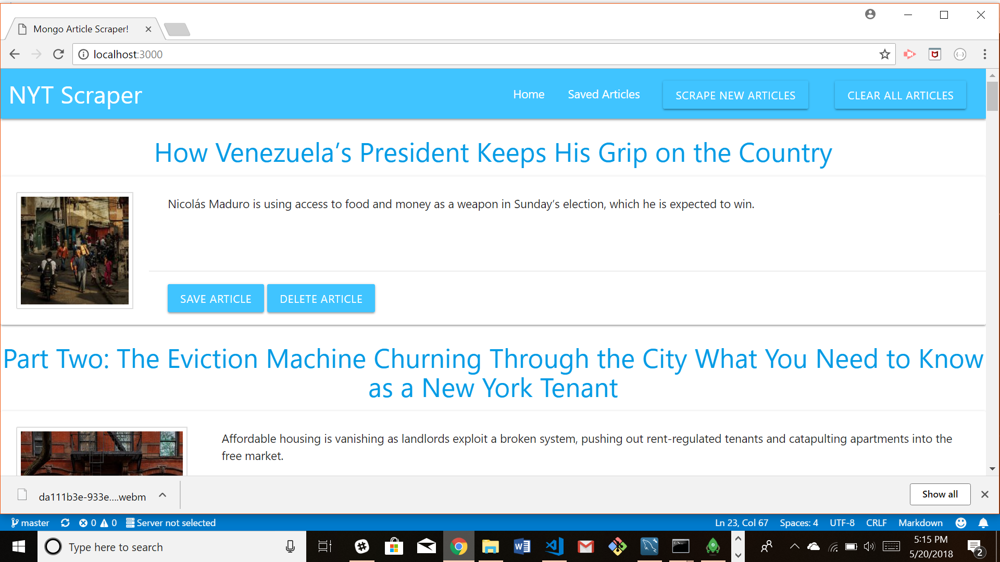
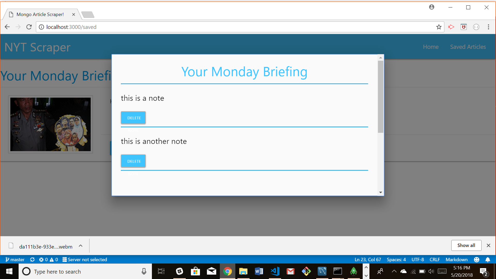

# MongoScraper

This project was created by Jaime Halupka as a requirement for homework during University of Central Florida's Coding Bootcamp. 

### Screenshots

Main Screen

Populated with Articles

Notes Option

### Description

This application scrapes recent articles from the New York Times site. Once displayed, articles can be saved to a saved list. Notes can then be added/deleted to/from saved articles through a modal. Articles can be removed from the saved list and all articles can be cleared in preparation for a new scrape.

### Link to Application

[Heroku Link]()

### GIFs

[GIF Link](https://gfycat.com/gifs/detail/UnfitDopeyHarborporpoise)

### Node Packages Used

* express
* body-parser
* express-handlebars
* mongoose
* cheerio
* request
